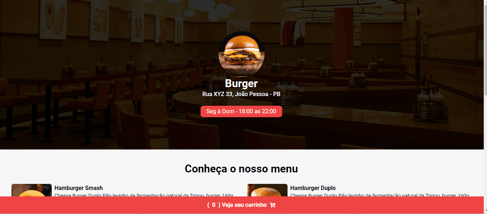

# Burger

## Descrição
    Esse é um projeto que simula um menu e pedidos de um restaurante em um carrinho.

## Funcionalidades

- Verifica se o horário do pedido está de acordo com o funcionamento do restaurante.
- Adicionar e remover itens do carrinho.
- Buscar CEP para entrega.

## Tecnologias

- Tailwind: Estilizar o projeto de forma mais dinâmica. 
- ViaCEP: Usada para buscar as informações do endereço.

## Gifs

### Navegação


## Como utilizar

### clone do projeto
```
    git clone https://github.com/Ryanvrl/burger.git
```

### Acessar a pasta
```
    cd "projeto"
```

### Instalação
```
    npm install
```

### Começar
```
    npm start
```